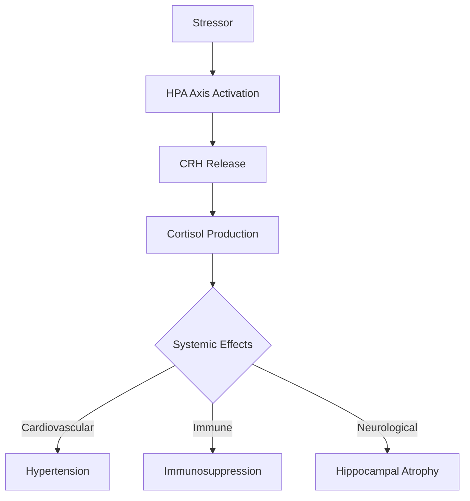

# The Lethal Mechanisms of Chronic Stress: A Multidisciplinary Analysis  

## Executive Summary  
Chronic stress exerts lethal effects through dysregulated physiological pathways, societal stressors, and modern lifestyle factors. The **COASTER** (Chronically Over-Active Stress Response) mechanism, driven by elevated cortisol and CRH (Corticotropin-Releasing Hormone), disrupts cardiovascular, immune, and neurological systems. Population density, sedentary lifestyles, and synthetic environments exacerbate stress, triggering hypertension, metabolic disorders, and neurodegeneration. This report synthesizes evidence linking stress to mortality, emphasizing the need for systemic interventions to address root causes like overpopulation and unsustainable living conditions.  

---

### Key Concepts  
| Concept          | Description                                                                 |  
|------------------|-----------------------------------------------------------------------------|  
| **COASTER**      | Chronic stress response causing systemic physiological dysfunction.           |  
| **Cortisol**     | Stress hormone impairing immune function and accelerating aging.               |  
| **CRH**          | Hormone initiating the HPA axis activation during stress.                      |  
| **Population Density Stress** | Urban overcrowding intensifying cortisol release and social fragmentation. |  
| **General Adaptation Syndrome (GAS)** | Three-phase stress response: alarm, resistance, exhaustion. |  

---

## Introduction  
Stress, a universal human experience, has evolved from an adaptive survival mechanism to a leading cause of preventable mortality. This report examines the interplay between stress physiology, societal structures, and modern lifestyles to explain why chronic stress kills. Drawing on interdisciplinary evidence, it bridges biological, psychological, and sociological frameworks to propose actionable solutions.  

---

## Core Concepts Analysis  

### 1. **The Stress Response Pathway**  
The hypothalamic-pituitary-adrenal (HPA) axis governs stress via CRH release, triggering cortisol production. Chronic activation disrupts:  
- **Cardiovascular System**: Hypertension, atherosclerosis, and arrhythmias due to vasoconstriction and endothelial dysfunction.  
- **Immune System**: Immunosuppression, increasing susceptibility to infections and cancer.  
- **Neurological System**: Hippocampal atrophy, memory decline, and depression via glucocorticoid toxicity.  



### 2. **Modern Stressors Amplifying COASTER**  
- **Population Density**: Urban overcrowding elevates cortisol via social fragmentation and resource competition.  
- **Sedentary Lifestyle**: Prolonged sitting and synthetic materials (e.g., vinyl) disrupt thermoregulation and induce cellular stress.  
- **Consumerism**: Overconsumption and debt-driven lifestyles perpetuate chronic stress cycles.  

### 3. **Psychological and Societal Impacts**  
- **Decision-Making Impairment**: Stress-induced tunnel vision and premature closure in high-stakes scenarios (e.g., medical errors).  
- **Social Isolation**: Fragmented communities reduce stress-buffering social support networks.  

---

## Critical Evaluation  

### Strengths of Current Models  
- **COASTER** provides a unifying framework for understanding modern stress-related pathologies.  
- Cortisol’s role in aging and disease progression is well-documented.  

### Limitations and Contradictions  
- **Reductionist Bias**: Overemphasis on individual-level interventions neglects systemic drivers like overpopulation.  
- **Cultural Variability**: Stress responses differ across populations (e.g., hunter-gatherer resilience vs. urban vulnerability).  

### Ethical Considerations  
- **Equity Gaps**: Marginalized groups face disproportionate stress burdens due to systemic inequities.  

---

## Comparative Context  

### COASTER vs. Historical Stress Models  
| Framework          | Focus                          | Limitations                     |  
|--------------------|--------------------------------|---------------------------------|  
| **General Adaptation Syndrome (GAS)** | Three-phase stress response       | Ignores modern societal stressors. |  
| **COASTER**         | Chronic stress in modern contexts | Requires population-level solutions. |  

### Cross-Cultural Comparisons  
- **Hunter-Gatherer Societies**: Low population density and clan-based support mitigate stress.  
- **Modern Urban Environments**: High density and isolation amplify COASTER effects.  

---

## Conclusion  
Chronic stress kills through synergistic physiological, psychological, and societal mechanisms. Addressing this crisis demands:  
1. **Policy Interventions**: Urban planning prioritizing green spaces and community networks.  
2. **Individual Strategies**: Mindfulness, cortisol-lowering diets (e.g., magnesium-rich foods), and physical activity.  
3. **Systemic Reforms**: Population control measures and sustainable resource management.  

### Broader Impact  
Reducing stress mortality requires a paradigm shift toward ecological sustainability and social cohesion. By aligning public health with environmental stewardship, societies can mitigate the COASTER effect and foster resilience.  

```  
"Stress is not merely a personal failing but a systemic symptom of unsustainable living—a call to reimagine humanity’s relationship with itself and the planet."  
```  

---  
This synthesis underscores stress as both a biological process and a societal challenge, demanding interdisciplinary collaboration to ensure a healthier, less stressed future.